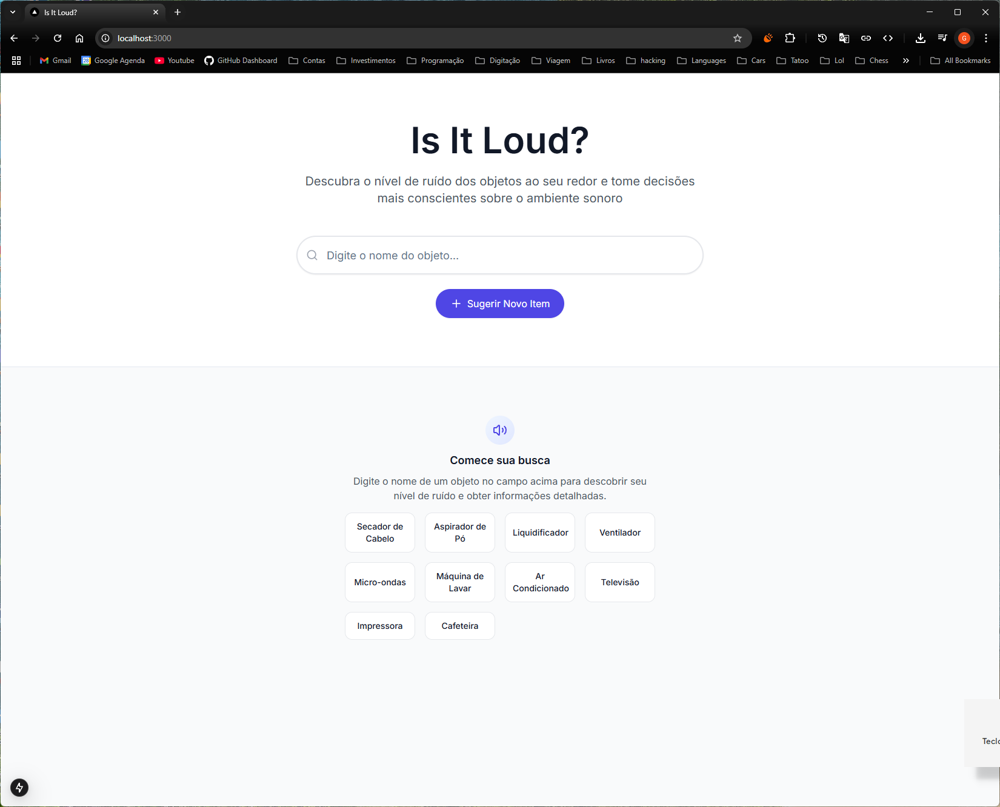
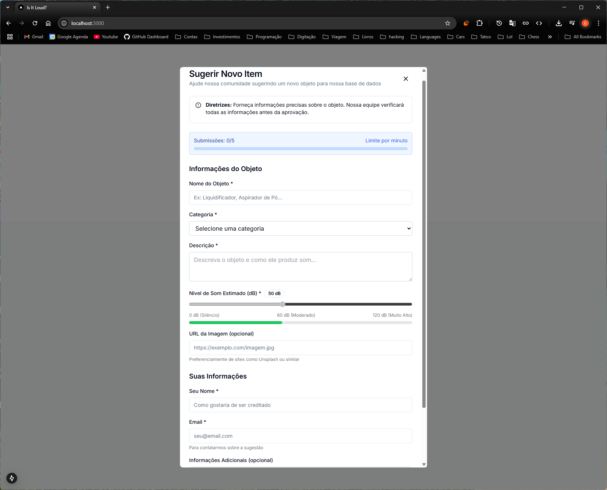
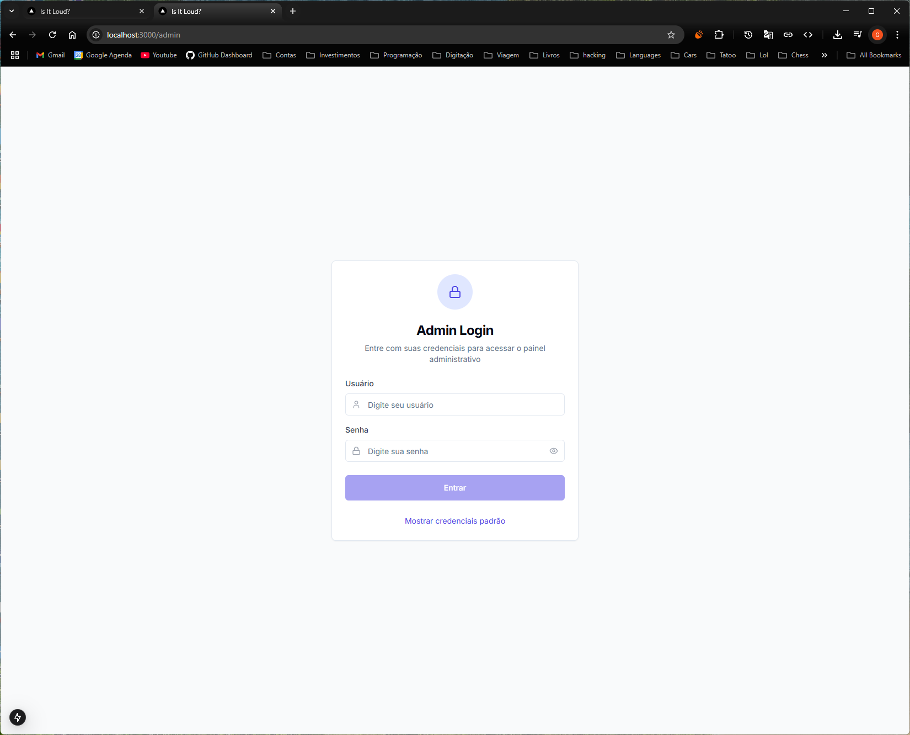
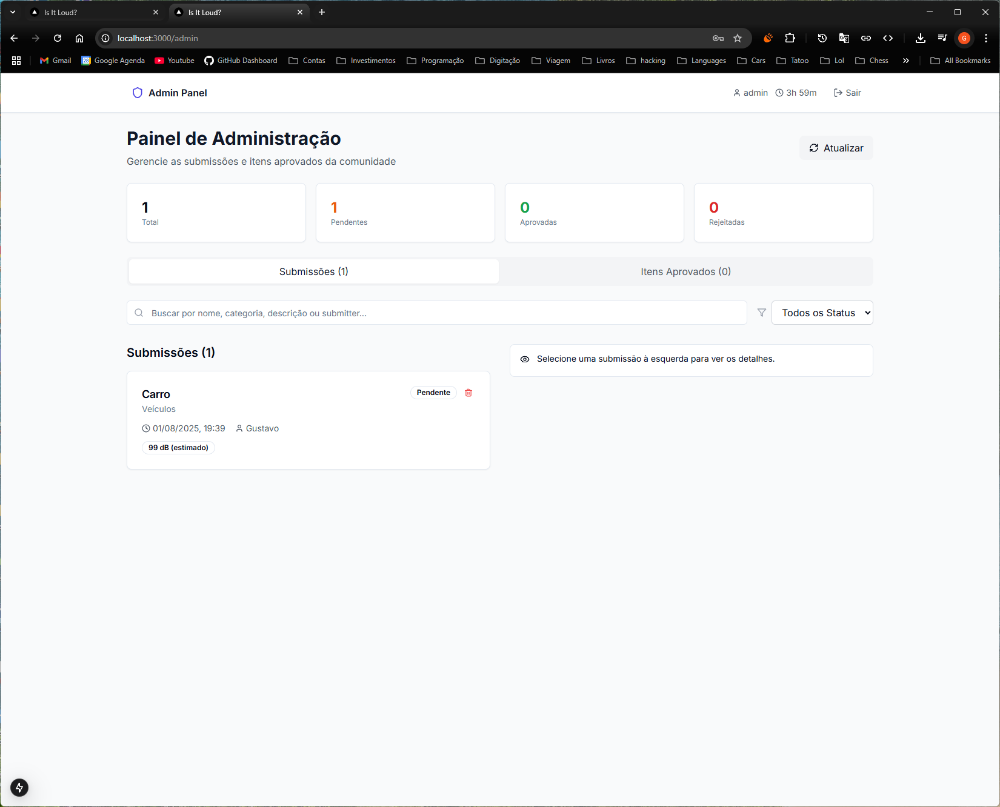
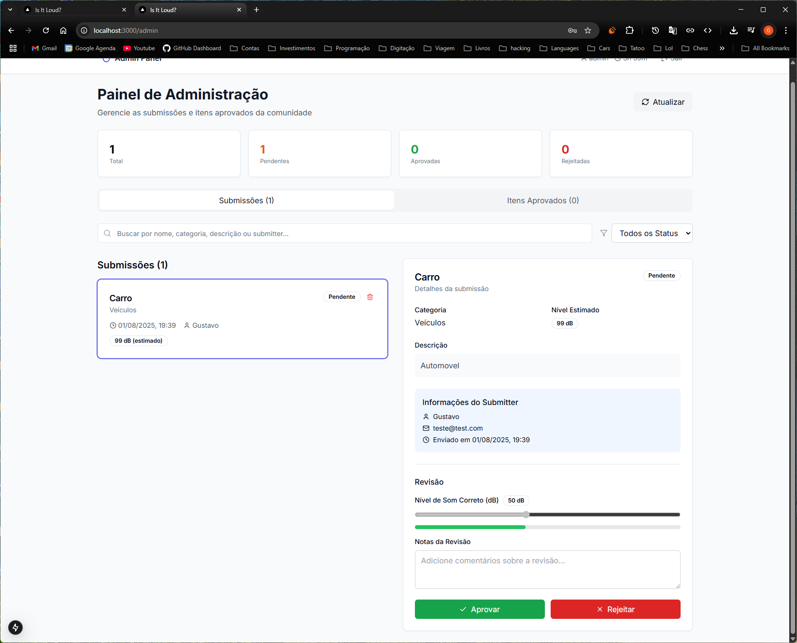

# 🔊 Is It Loud?
### Consciência Sonora para Todos

> Uma plataforma inovadora que torna os níveis de ruído visíveis e compreensíveis, especialmente projetada para auxiliar pessoas surdas a entenderem melhor o ambiente sonoro ao seu redor.

[](https://nextjs.org/)
[](https://www.typescriptlang.org/)
[](https://tailwindcss.com/)
[](https://reactjs.org/)

---

## 📖 Índice

- [🎯 Sobre o Projeto](#-sobre-o-projeto)
- [✨ Funcionalidades](#-funcionalidades)
- [🖼️ Screenshots](#️-screenshots)
- [🚀 Tecnologias](#-tecnologias)
- [⚙️ Instalação](#️-instalação)
- [🎮 Como Usar](#-como-usar)
- [🔐 Sistema de Administração](#-sistema-de-administração)
- [🛡️ Segurança](#️-segurança)
- [🤝 Contribuindo](#-contribuindo)
- [📄 Licença](#-licença)

---

## 🎯 Sobre o Projeto

O **Is It Loud?** é uma ferramenta de acessibilidade que transforma informações sonoras em dados visuais compreensíveis. Desenvolvida com foco na inclusão, a plataforma ajuda pessoas surdas a:

- 🏠 Compreender o impacto sonoro de aparelhos domésticos
- 🎚️ Visualizar níveis de ruído através de indicadores visuais
- 🤝 Melhorar a convivência em ambientes compartilhados
- 📊 Tomar decisões informadas sobre o uso de objetos sonoros

### 🎯 Público-Alvo

- **Pessoas surdas** que buscam autonomia no uso de aparelhos
- **Familiares e cuidadores** que convivem com pessoas surdas
- **Profissionais da saúde** e educadores
- **Qualquer pessoa** interessada em consciência sonora

---

## ✨ Funcionalidades

### 🔍 **Busca Inteligente**
- Pesquisa por nome, categoria ou descrição
- Resultados em tempo real
- Filtros avançados por nível sonoro

### 📊 **Visualização de Dados**
- Indicadores visuais com código de cores
- Medição em decibéis (dB)
- Barras de progresso interativas
- Categorização por tipo de objeto

### 👥 **Sistema Colaborativo**
- Submissão de novos itens pela comunidade
- Sistema de moderação manual
- Rate limiting para prevenção de spam
- Feedback detalhado para contribuições

### 🔐 **Painel Administrativo**
- Interface completa de gerenciamento
- Sistema de autenticação seguro
- Moderação de submissões
- Analytics e estatísticas

### 🛡️ **Recursos de Segurança**
- Autenticação com sessões temporárias
- Rate limiting (5 submissões/minuto)
- Proteção contra spam e abuso
- Validação completa de dados

---

## 🖼️ Screenshots

### 🏠 Página Inicial
*Interface limpa com busca intuitiva e call-to-action para contribuições*



### 🔍 Resultados de Busca
*Grid responsivo com indicadores visuais de nível sonoro*

> **Nota**: Para ver os resultados de busca, digite qualquer item (ex: "liquidificador") na barra de pesquisa da página inicial.

### 📝 Formulário de Submissão
*Interface completa para contribuições da comunidade com rate limiting*



### 🔐 Login Administrativo
*Sistema de autenticação seguro para moderadores*



### 📋 Painel Administrativo
*Interface de moderação com filtros e busca avançada*



### 🔍 Revisão Detalhada
*Interface completa para análise e aprovação de submissões*



---

## 🚀 Tecnologias

### **Frontend**
- **Next.js 15.0** - Framework React com SSR
- **React 19.0** - Biblioteca de interface
- **TypeScript 5.0** - Tipagem estática
- **Tailwind CSS 3.4** - Framework de estilos
- **Radix UI** - Componentes acessíveis

### **Recursos Avançados**
- **Rate Limiting** - Controle de spam
- **Authentication** - Sistema de login seguro
- **localStorage** - Persistência local (dev)
- **Responsive Design** - Otimizado para todos dispositivos

### **Ferramentas de Desenvolvimento**
- **ESLint** - Linting de código
- **Prettier** - Formatação automática
- **Turbopack** - Build otimizado
- **PostCSS** - Processamento de CSS

---

## ⚙️ Instalação

### **Pré-requisitos**
- Node.js 18+ 
- npm ou yarn
- Git

### **1. Clone o Repositório**
```bash
git clone https://github.com/seu-usuario/is-it-loud.git
cd is-it-loud
```

### **2. Instale as Dependências**
```bash
npm install
# ou
yarn install
```

### **3. Execute o Projeto**
```bash
npm run dev
# ou
yarn dev
```

### **4. Acesse a Aplicação**
- **Frontend**: http://localhost:3000
- **Admin**: http://localhost:3000/admin

---

## 🎮 Como Usar

### **🔍 Buscar Itens**
1. Digite o nome do objeto na barra de pesquisa
2. Visualize os resultados com indicadores de som
3. Clique nos quick-buttons para busca rápida

### **📝 Contribuir com Novos Itens**
1. Clique em "Sugerir Novo Item"
2. Preencha o formulário completo
3. Aguarde a moderação (24-48h)
4. **Limite**: 5 submissões por minuto

### **📊 Entender os Níveis Sonoros**
- 🟢 **0-60 dB**: Baixo (conversa normal)
- 🟡 **60-80 dB**: Moderado (trânsito)
- 🔴 **80+ dB**: Alto (pode causar desconforto)

---

## 🔐 Sistema de Administração

### **🔑 Acesso Administrativo**
- **URL**: `/admin`
- **Credenciais padrão**:
  - Usuário: `admin`
  - Senha: `admin123`

### **🛠️ Funcionalidades Admin**
- ✅ Aprovar/rejeitar submissões
- 🔍 Busca avançada e filtros
- 🗑️ Exclusão de conteúdo
- 📊 Estatísticas em tempo real
- 👥 Gerenciamento de usuários

### **⏱️ Gestão de Sessão**
- **Duração**: 4 horas
- **Extensão**: Disponível 30min antes do vencimento
- **Auto-logout**: Em caso de inatividade

---

## 🛡️ Segurança

### **🔐 Autenticação**
- Hashing de senhas (produção: bcrypt)
- Sessões com expiração automática
- Proteção contra ataques de força bruta

### **⚡ Rate Limiting**
- **Submissões**: 5 por minuto por usuário
- **Fingerprinting**: Identificação por browser
- **Cleanup automático**: Limites expirados

### **🛡️ Validação de Dados**
- Sanitização de inputs
- Validação de URLs de imagem
- Prevenção de XSS e injection

### **🔒 Controle de Acesso**
- Rotas protegidas
- Middleware de autorização
- Separação de privilégios

---

## 🤝 Contribuindo

### **📋 Como Contribuir**
1. Fork o projeto
2. Crie uma branch (`git checkout -b feature/nova-funcionalidade`)
3. Commit suas mudanças (`git commit -m 'Adiciona nova funcionalidade'`)
4. Push para a branch (`git push origin feature/nova-funcionalidade`)
5. Abra um Pull Request

### **🐛 Reportar Bugs**
- Use as [Issues do GitHub](https://github.com/seu-usuario/is-it-loud/issues)
- Descreva o problema detalhadamente
- Inclua screenshots se possível

### **💡 Sugerir Funcionalidades**
- Abra uma issue com o label `enhancement`
- Descreva o caso de uso
- Explique o benefício para a comunidade

---

## 📄 Licença

Este projeto está sob a licença MIT. Veja o arquivo [LICENSE](LICENSE) para mais detalhes.

---

## 🌟 Reconhecimentos

- **Comunidade Surda** - Inspiração e feedback
- **Unsplash** - Imagens de alta qualidade
- **Radix UI** - Componentes acessíveis
- **Vercel** - Plataforma de deploy

---

<div align="center">

**Feito com ❤️ para tornar o mundo mais acessível**

[⭐ Star este projeto](https://github.com/seu-usuario/is-it-loud) • [🐛 Reportar Bug](https://github.com/seu-usuario/is-it-loud/issues) • [💡 Sugerir Feature](https://github.com/seu-usuario/is-it-loud/issues)

</div>
